# ==生成式模型简介==


**生成式模型是一类旨在学习给定数据集底层概率分布的机器学习模型，从而能够生成与原始数据分布高度相似的新样本。**


##  1. 核心特点

- 生成模型既存在于**监督学习**也存在于**非监督学习**中：自动发现并学习输入数据中的规律或模式；

- 支持三大能力：
  - 无监督学习  
  - 数据合成（生成逼真且多样化的样本）  
  - 表征学习  
  
- 在人工智能中扮演关键角色，广泛应用于图像、文本、语音等生成任务。

  

## 2. 主要模型类别


- **现代主流模型**： 
  自编码器、生成对抗网络（GAN）、扩散模型、大语言模型（LLM）
  
- **经典先驱模型**： 
  隐马尔可夫模型（HMM）等——它们通过对现有数据的统计分布建模，实现新数据的生成。
  
  

## 3. 模型分类体系


**图1：机器学习模型分类体系**

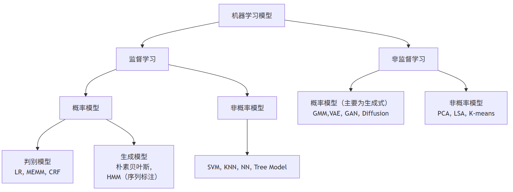

- **顶层**：机器学习模型 
  └─ **监督学习** 
   ├─ 概率模型 → **判别模型**（如 LR、MEMM、CRF） 
   └─ 概率模型 → **生成模型** (如 朴素贝叶斯、 HMM(序列标注))
   └─ 非概率模型 → SVM、KNN、NN、Tree Model 
  └─ **非监督学习** 
   ├─ 概率模型 → **主要为生成式**（如GMM、VAE、GAN、Diffusion） 
   └─ 非概率模型 → PCA、LSA、K-means 等


# ==生成式模型的理论基础==


## 1. 目标：建模联合分布以统一生成与推理


生成式模型的根本任务是学习数据的**联合概率分布**：

​                                 <span style="color:#9370DB">**目的：     $P(X,Y)$   （有监督）      或者        $P(X)$      (无监督)**</span>    

其中 $X$ 表示输入特征，$Y$ 表示标签（若有）。 
一旦掌握该联合分布，即可实现：

- **生成**：从 $P(X \mid Y)$ 或 $P(X)$ 中采样新样本；

- **推断**：计算条件概率 $P(Y \mid X)$ 用于分类；

- **插值与控制**：在潜在空间中进行平滑操作。
  
  


---

## 2. 推理：通过贝叶斯定理从联合分布导出条件概率


生成模型不直接拟合 $P(Y \mid X)$，而是先建模**似然** $P(X \mid Y)$ 与**先验** $P(Y)$，再利用贝叶斯规则合成所需条件概率：

$$
P(Y \mid X) = \frac{P(X, Y)}{P(X)} = \frac{P(X \mid Y) P(Y)}{P(X)}
$$

其中：
- $P(Y)$ 是标签的先验分布（可由训练集中类别频率估计）；
- $P(X \mid Y)$ 是似然函数（对每个类别建模输入特征的分布）；
- <span style="color:#9370DB">$P(X) = \sum_Y P(X \mid Y) P(Y)$</span> 是边缘分布（归一化常数）。

> 在许多实际场景中，直接估计 $P(Y \mid X)$ 困难或不稳定，而建模 $P(X \mid Y)$ 和 $P(Y)$ 更可行。 
> 获得 $P(Y \mid X)$ 后，可执行：
>
> - 分类：$\hat{y} = \arg\max_y P(y \mid x)$；
> - 期望：$E[Y \mid X]$；
> - 甚至后验采样（在某些模型中）。


---

## 3. 结构简化：利用条件独立性降低建模复杂度


高维联合分布 $P(X_1, \dots, X_n, Y)$ 参数量巨大，难以直接估计。为此，生成模型引入**结构假设**，通过变量间的**条件独立性**对联合分布进行因式分解。

一般形式为：
$$
P(X_1, X_2, \ldots, X_n, Y) = P(Y) \prod_{i=1}^{n} P(X_i \mid \text{Pa}(X_i))
$$
其中 $\text{Pa}(X_i)$ 表示 $X_i$ 的父节点。例如，在下图所示的贝叶斯网络中：

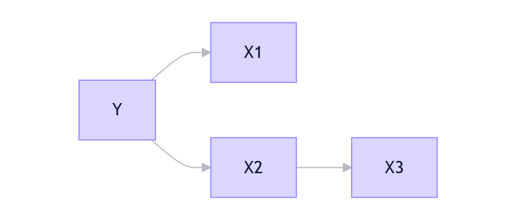

- $Y$ 是 $X_1, X_2$ 的父节点；

- $X_2$ 是 $X_3$ 的父节点；

- 因此联合分布分解为 $P(Y) P(X_1|Y) P(X_2|Y) P(X_3|X_2)$。

  


### 特例：朴素贝叶斯
假设所有特征在给定 $Y$ 下相互独立，即 $\text{Pa}(X_i) = \{Y\}$，则：
$$
P(Y \mid x_1, \dots, x_n) \propto P(Y) \prod_{i=1}^n P(x_i \mid Y)
$$


---


## 4. 具体模型：经典与现代生成模型的数学形式


### (a) 高斯混合模型（GMM）
用于无监督建模 $P(X)$，假设数据由 $m$ 个高斯分量混合而成。多元高斯密度为：
$$
F_G(x) = \frac{\exp\left(-\frac{1}{2}(x - \mu)^\top \Sigma^{-1} (x - \mu)\right)}{(2\pi)^{d/2} |\Sigma|^{1/2}}
$$
整体模型表示为：
$$
P(X) = \sum_{i=1}^m w_i F_G(x \mid \mu_i, \Sigma_i)
$$
其中 $w_i$ 为混合权重，通常通过期望最大化（EM）算法或最大后验概率（MAP）训练。


### (b) 隐马尔可夫模型（HMM）
专为时间序列设计，假设观测序列 $O = (o_1, \dots, o_T)$ 由隐藏状态序列 $S = (s_1, \dots, s_T)$ 生成，且满足马尔可夫性质：
$$
P(O, S) = P(s_1) \prod_{t=2}^T P(s_t \mid s_{t-1}) \prod_{t=1}^T P(o_t \mid s_t)
$$


### (c) 变分自编码器（VAE）

引入连续潜在变量 $z$，近似后验 $q_\phi(z \mid x)$，优化证据下界（ELBO）：

$$
\log P(X) \geq \mathbb{E}_{q_\phi(z \mid x)}[\log P_\theta(x \mid z)] - D_{\text{KL}}(q_\phi(z \mid x) \parallel p(z))
$$


### (d) 生成对抗网络（GAN）

通过极小极大博弈训练生成器 $G$ 和判别器 $D$：

$$
\min_G \max_D V(D, G) = \mathbb{E}_{x \sim p_{\text{data}}}[\log D(x)] + \mathbb{E}_{z \sim p_z}[\log(1 - D(G(z)))]
$$


# ==生成模型 vs 判别模型==


​         生成式模型与判别式模型存在关键区别。**判别式模型**学习类别之间的决策边界，并建模**条件概率**分布 $P(y \mid x)$；而**生成式模型**学习每个类别的真实分布，并建模**联合概率**分布 $P(x, y)$，该分布可通过贝叶斯定理用于预测条件概率。生成式模型可以通过从估计的联合分布 $P(x, y)$ 中采样来生成**从未观察过的合成样本**，而判别式模型则侧重于将特征映射到目标变量。以下的表格详细的对比了两种模型的区别。


| 维度 | 判别模型 | 生成模型 |
|------|--------|--------|
| **建模对象** | $P(Y \mid X)$ | $P(X, Y) = P(X \mid Y) P(Y)$ |
| **训练目标** | 学习决策边界 | 学习数据生成机制 |
| **输出能力** | 仅能分类/回归 | 可分类、可生成、可插值、可填补缺失 |
| **典型代表** | 逻辑回归、SVM、神经网络（判别式） | 朴素贝叶斯、GMM、HMM、VAE、GAN |
| **分类规则** | $\hat{y} = \arg\max_y P(y \mid x)$ | $\hat{y} = \arg\max_y \dfrac{P(x \mid y) P(y)}{P(x)}$ |

>  注意：由于 $P(x)$ 对所有 $y$ 相同，生成模型在分类时只需比较分子 $P(x \mid y) P(y)$。


**总的来说生成模型通过建模数据如何被“生成”（即联合分布 $P(X,Y)$），从而不仅能做判别任务，更能创造新数据——这是它与判别模型的本质区别。**


> 本部分内容基于以下两篇公开资料总结而来：
> - [Generative Model（生成模型）— ScienceDirect 主题词条](https://www.sciencedirect.com/topics/computer-science/generative-model)
>- [《机器学习中生成模型的全面综述》— Wang et al., Computer Science Review, 2021](https://www.sciencedirect.com/science/article/abs/pii/S1574013720303853)


# ==主流生成模型概述与实际运用==


## 1. 变分自编码器（VAE）

- **自编码器的概念**：自编码器是一种用于学习数据有效表示的人工神经网络，这种方法表模型讨图用尽可能的特征，要描述更大的数据向朋友描述一个人时往往会用这个人上最具有代表性的特征来描述这个人。其中自编码器中的特征学习是将复杂的数据转化为更简单更有意义的表示形式，又称为潜在空间。


- **编码器的基本组成部分**

  编码器将图片输入到模型中由编码器  

  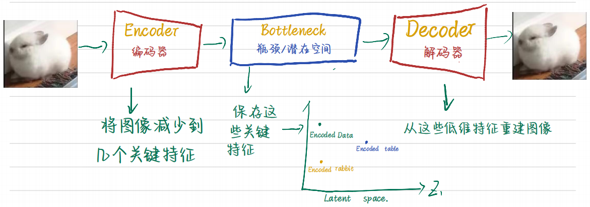

- **编码器的训练过程**

  （1）训练自编码器的重点是最小化原始数据与其重建版本之间的差异

  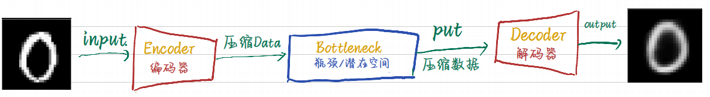

  （2）目标是提高解码器准确重建原始数据的能力从其压缩表示

  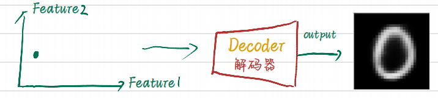

  （3）同时编码器在压缩数据的方式上变得更好以保留关键信息，确保原始数据可以有效的重建

  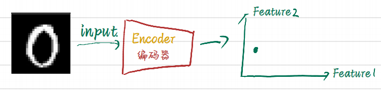

- **训练损失**

  比较两幅图最好的方法是逐个像素进行比较，我们可以计算对应像素之间的差异，然后取这些差异的平均值这种方法称为均方误差。

  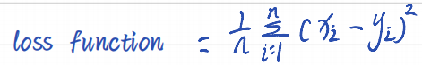

  通过比较两幅图的均方误差来学习。

- **编码器的优缺点**

  **编码器的优点**：能够执行数据降维并且潜在空间的维度由瓶颈层中的神经元数量来决定

  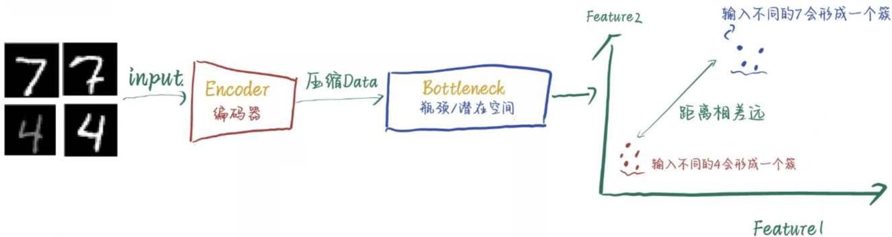

  就如上面所示，若潜在空间有2个神经元，则可以将输入的数据转化为2个特征。潜在空间的表示就是学习样本特征并且根据学习到的特征在潜在空间中表示出来（最近邻算法）。

  有3个数据集、就用三准空间中的三个坐标进行编码 若数据在2维空间中显示不出来那么可以用更高维度的空间来分离。

  **编码器的缺点**:潜在空间分不同簇时效果不是很好，其次自编码器很容易学习到噪声数据，因此现在大多数自编码器都会规范潜在空间，最著名的规范自编码器类型为变分自编码器（Auto-Encoders）。

- **变分自编码器**（(VAE,Variational Auto-Encode ）

  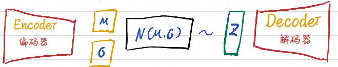

  为什么会需要这种模型，为什么传统自编码器不能自己生成图像？

  自编码器将数据输入然后重建为低维表示，理想状态下希望有一个更好的潜在空间，里面有一些连贯的点。理想状态下希望有一个更好的潜在空间，里面有一些连贯的点.

  （1）**VAE理论基础**；目地从给出的$p(x)$ 中生成新数据.VAE的理论基础如下图所示：

  $p(z)$代表潜在变量在潜在空间的分布，目地捕捉低谁向量在空间中的特征,因些需要用$p(z)$来映射来求$p(x)$.

  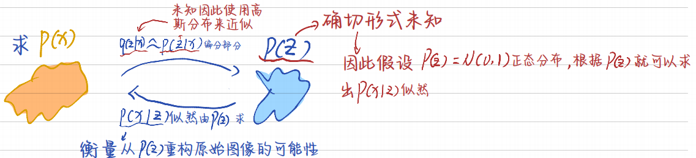

  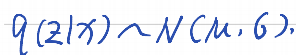其中平均值和方差都是要去学习的（这过程称为变分不叶斯优化过程）。其中使用编码器来计算平均值和方差，而使用解码器是用来生成新的数据

  （2）**VAE的训练过程**

  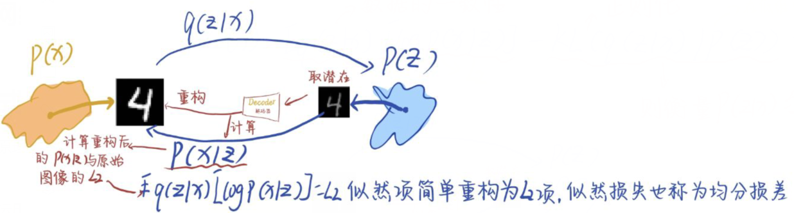

  （3）**损失函数**

  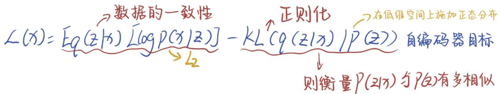

  自分编码器将连入数据映射为某个概率分布，（一般为高斯）也就是将输入的数据转化为高斯中的参数平均值和方差。

  （4）**重新化参数**：由于我们不能通过网络反向传播从高斯分布中随机抽样不从高斯分布中直接抽样而是引入一个随机变量来处理网络外的随机性。

  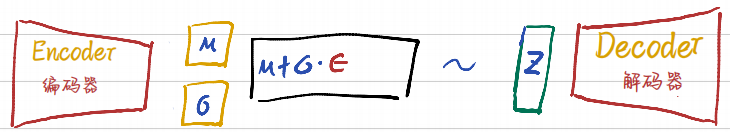

  具体实现：从标准正态分布中随机抽取一点。

  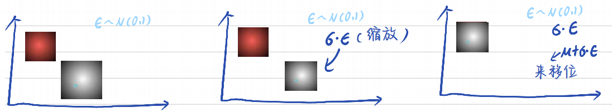

  这个技巧使我们可以通过 网络反向传播使我们可以使用标准的基于梯度的优化技术Adam端到 的训练，VAE.

  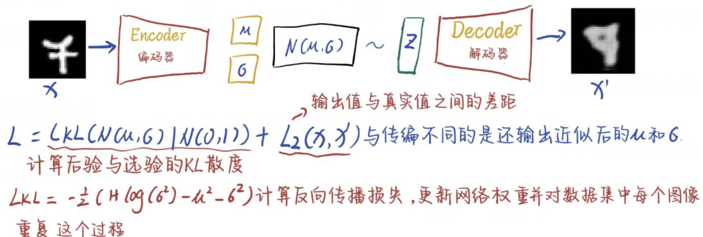

  将一个数据编码到潜在空间，然后通过对这个数据在潜在空间周围的值进行抽样最后还原这个数据。变分自编码器优点很多，但同时也存在多个不足，就比如，VAE更倾向于产生模糊的图像，在更复杂的数据时主成的图像更模糊。

- **与传统自编码器的区别**

  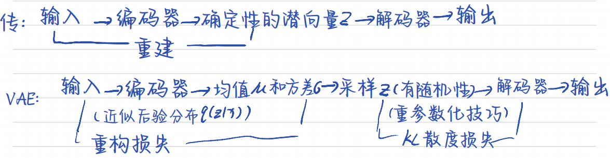

- **VAE的代码实现**

  ````
  # -*- coding: utf-8 -*-
  import torch
  import torch.nn as nn
  import torch.optim as optim
  from torch.utils.data import DataLoader, TensorDataset
  import torchvision.utils as vutils
  import matplotlib.pyplot as plt
  import numpy as np
  from sklearn.metrics import mean_squared_error
  
  # 从 Keras 加载 MNIST
  from tensorflow.keras.datasets import mnist
  
  # 设置设备
  device = torch.device("cuda" if torch.cuda.is_available() else "cpu")
  print(f"Using device: {device}")
  
  # ----------------------------
  # 1. 加载并预处理 MNIST 数据
  # ----------------------------
  (x_train, y_train), (x_test, y_test) = mnist.load_data()
  x_train = x_train.astype('float32') / 255.0
  x_test = x_test.astype('float32') / 255.0
  
  x_train_tensor = torch.tensor(x_train).unsqueeze(1)
  x_test_tensor = torch.tensor(x_test).unsqueeze(1)
  
  batch_size = 128
  train_loader = DataLoader(TensorDataset(x_train_tensor, torch.tensor(y_train)), 
                            batch_size=batch_size, shuffle=True)
  test_loader = DataLoader(TensorDataset(x_test_tensor, torch.tensor(y_test)), 
                           batch_size=batch_size, shuffle=False)
  
  # ----------------------------
  # 2. 定义 VAE 模型
  # ----------------------------
  class VAE(nn.Module):
      def __init__(self, latent_dim=20):
          super(VAE, self).__init__()
          self.latent_dim = latent_dim
  
          # 编码器
          self.encoder = nn.Sequential(
              nn.Conv2d(1, 32, kernel_size=4, stride=2, padding=1),
              nn.ReLU(),
              nn.Conv2d(32, 64, kernel_size=4, stride=2, padding=1),
              nn.ReLU(),
              nn.Conv2d(64, 128, kernel_size=7),
              nn.ReLU()
          )
          self.fc_mu = nn.Linear(128, latent_dim)
          self.fc_logvar = nn.Linear(128, latent_dim)
  
          # 解码器
          self.decoder_input = nn.Linear(latent_dim, 128)
          self.decoder = nn.Sequential(
              nn.ConvTranspose2d(128, 64, kernel_size=7),
              nn.ReLU(),
              nn.ConvTranspose2d(64, 32, kernel_size=4, stride=2, padding=1),
              nn.ReLU(),
              nn.ConvTranspose2d(32, 1, kernel_size=4, stride=2, padding=1),
              nn.Sigmoid()
          )
  
      def encode(self, x):
          h = self.encoder(x)
          h = h.view(h.size(0), -1)
          mu = self.fc_mu(h)
          logvar = self.fc_logvar(h)
          return mu, logvar
  
      def reparameterize(self, mu, logvar):
          std = torch.exp(0.5 * logvar)
          eps = torch.randn_like(std)
          return mu + eps * std
  
      def decode(self, z):
          h = self.decoder_input(z)
          h = h.view(h.size(0), 128, 1, 1)
          return self.decoder(h)
  
      def forward(self, x):
          mu, logvar = self.encode(x)
          z = self.reparameterize(mu, logvar)
          recon_x = self.decode(z)
          return recon_x, mu, logvar
  
  # ----------------------------
  # 3. 损失函数（返回总损失、BCE、KLD）
  # ----------------------------
  def vae_loss(recon_x, x, mu, logvar, beta=1.0):
      BCE = nn.functional.binary_cross_entropy(recon_x, x, reduction='sum')
      KLD = -0.5 * torch.sum(1 + logvar - mu.pow(2) - logvar.exp())
      total_loss = BCE + beta * KLD
      return total_loss, BCE, KLD
  
  # ----------------------------
  # 4. 训练设置
  # ----------------------------
  latent_dim = 20
  beta = 1.0  # 可设为 0.5 提升多样性
  model = VAE(latent_dim=latent_dim).to(device)
  optimizer = optim.Adam(model.parameters(), lr=1e-3)
  
  num_epochs = 20
  
  # ----------------------------
  # 5. 训练循环（含 KL annealing）
  # ----------------------------
  model.train()
  for epoch in range(num_epochs):
      train_total = train_bce = train_kld = 0
      beta_epoch = min(beta, (epoch + 1) / 10.0)  # KL annealing: 前10轮从0→beta
      
      for batch_idx, (data, _) in enumerate(train_loader):
          data = data.to(device)
          optimizer.zero_grad()
          recon_batch, mu, logvar = model(data)
          loss, bce, kld = vae_loss(recon_batch, data, mu, logvar, beta=beta_epoch)
          loss.backward()
          train_total += loss.item()
          train_bce += bce.item()
          train_kld += kld.item()
          optimizer.step()
  
      avg_total = train_total / len(train_loader.dataset)
      avg_bce = train_bce / len(train_loader.dataset)
      avg_kld = train_kld / len(train_loader.dataset)
      per_pixel = avg_total / (28 * 28)
      
      print(f'Epoch [{epoch+1}/{num_epochs}] | '
            f'Total: {avg_total:.4f} | '
            f'BCE: {avg_bce:.4f} | '
            f'KLD: {avg_kld:.4f} | '
            f'Per-Pixel: {per_pixel:.6f} | '
            f'KL Ratio: {avg_kld/avg_total:.2%}')
  
  # ----------------------------
  # 6. 测试评估（全面指标）
  # ----------------------------
  model.eval()
  test_total = test_bce = test_kld = 0
  all_mse = []
  
  with torch.no_grad():
      for data, _ in test_loader:
          data = data.to(device)
          recon, mu, logvar = model(data)
          loss, bce, kld = vae_loss(recon, data, mu, logvar, beta=1.0)
          test_total += loss.item()
          test_bce += bce.item()
          test_kld += kld.item()
          
          # 计算 MSE
          mse = mean_squared_error(
              data.cpu().numpy().reshape(-1),
              recon.cpu().numpy().reshape(-1)
          )
          all_mse.append(mse)
  
  avg_test_total = test_total / len(test_loader.dataset)
  avg_test_bce = test_bce / len(test_loader.dataset)
  avg_test_kld = test_kld / len(test_loader.dataset)
  avg_mse = np.mean(all_mse)
  per_pixel_test = avg_test_total / (28 * 28)
  
  print("\n" + "="*60)
  print("  测试集最终评估结果:")
  print(f"  总 VAE 损失: {avg_test_total:.4f}")
  print(f"  重构损失 (BCE): {avg_test_bce:.4f}")
  print(f"  KL 散度 (KLD): {avg_test_kld:.4f}")
  print(f"  KL 占比: {avg_test_kld / avg_test_total:.2%}")
  print(f"  每像素平均损失: {per_pixel_test:.6f}")
  print(f"  平均 MSE: {avg_mse:.6f}")
  print("="*60)
  
  # ----------------------------
  # 7. 可视化：原始 vs 重构
  # ----------------------------
  def show_reconstruction(model, data_loader, num_images=8):
      model.eval()
      with torch.no_grad():
          data, _ = next(iter(data_loader))
          data = data.to(device)
          recon, _, _ = model(data)
          comparison = torch.cat([data[:num_images], recon[:num_images]])
          grid = vutils.make_grid(comparison.cpu(), nrow=num_images, padding=2, normalize=True)
          plt.figure(figsize=(12, 4))
          plt.imshow(grid.permute(1, 2, 0))
          plt.axis('off')
          plt.title('Original (top) vs Reconstructed (bottom)')
          plt.tight_layout()
          plt.show()
  
  show_reconstruction(model, test_loader)
  
  # ----------------------------
  # 8. 生成新图像
  # ----------------------------
  def generate_new_images(model, num_images=8):
      model.eval()
      with torch.no_grad():
          z = torch.randn(num_images, latent_dim).to(device)
          generated = model.decode(z)
          grid = vutils.make_grid(generated.cpu(), nrow=num_images, padding=2, normalize=True)
          plt.figure(figsize=(12, 2))
          plt.imshow(grid.permute(1, 2, 0))
          plt.axis('off')
          plt.title('Generated MNIST Digits from Random Latent Vectors')
          plt.tight_layout()
          plt.show()
  
  generate_new_images(model)
  ````

  训练结果

  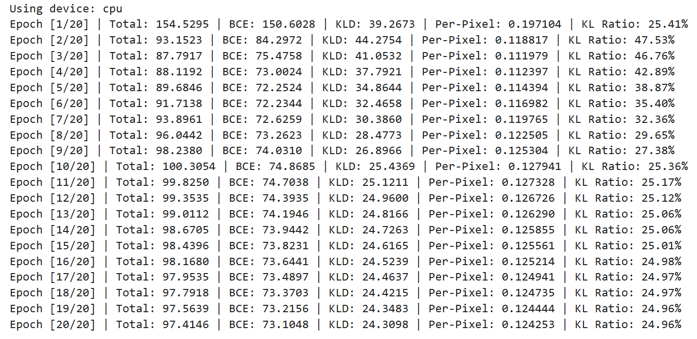

  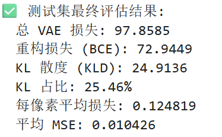

  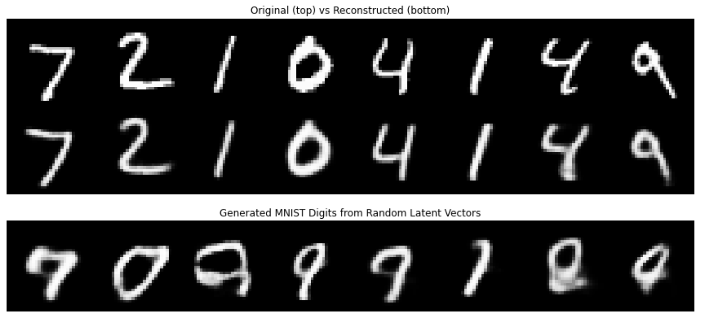


## 2.生成对抗网络（GAN、DCGAN）

- **核心思想**就是：通过两个神经网络来对抗训练来生成逼真的数据。生成器；生成假数据。判别器：区分真的数据和假的数据。

- **对抗过程**

  生成器生成假数据  -> 判别器对真实数据与假的数据进行判别 ->  通过反向传播,生成器学习生成更逼真的数据，判别器学习更准确地区分数据。

- **训练过程**

  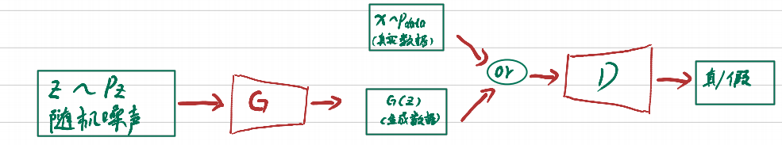

  真实数据分布生成器生成的分布因此损失函数的构建原则是判别器；尽可能找出生成器生成的数据与真实数据分布的差异，生成器；让生成器生成的数据分布接近真实数据分布。

- **损失函数**

  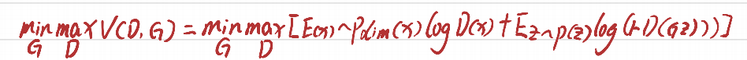

  具体计算分为两步：

  第一步：固定G，求损失最大的D实际上就是在求与之间的JS散度找到分布差异的度量。

  第二步：固定D，最小化第一步的结果，就是最小化JS散度让分布接近。其中JS散度是衡量两个概率分布之间相似性的一种对称、平滑的度量方法，是基于KL散度构造出来的。

- **具体代码实现**

  ```
  # -*- coding: utf-8 -*-
  import torch
  import torch.nn as nn
  import torch.optim as optim
  from torch.utils.data import DataLoader, TensorDataset
  import torchvision.utils as vutils
  import matplotlib.pyplot as plt
  import numpy as np
  
  # 从 Keras 加载 CIFAR-10
  from tensorflow.keras.datasets import cifar10
  
  # 设置设备
  device = torch.device("cuda" if torch.cuda.is_available() else "cpu")
  print(f"Using device: {device}")
  
  # ----------------------------
  # 1. 加载并预处理 CIFAR-10（来自 Keras）
  # ----------------------------
  (x_train, y_train), (x_test, y_test) = cifar10.load_data()
  
  # 归一化到 [-1, 1]（DCGAN 推荐范围，配合 Tanh 输出）
  x_train = (x_train.astype('float32') / 255.0) * 2.0 - 1.0  # shape: (50000, 32, 32, 3)
  
  # 转为 PyTorch 张量，并调整通道顺序: (N, H, W, C) → (N, C, H, W)
  x_train_tensor = torch.tensor(x_train).permute(0, 3, 1, 2)
  
  # 创建 DataLoader
  batch_size = 128
  train_loader = DataLoader(TensorDataset(x_train_tensor, torch.tensor(y_train)), 
                            batch_size=batch_size, shuffle=True)
  
  # ----------------------------
  # 2. 定义生成器（Generator）
  # ----------------------------
  class Generator(nn.Module):
      def __init__(self, nz=100, ngf=64, nc=3):
          super(Generator, self).__init__()
          self.main = nn.Sequential(
              # 输入: Z (nz, 1, 1)
              nn.ConvTranspose2d(nz, ngf * 8, 4, 1, 0, bias=False),
              nn.BatchNorm2d(ngf * 8),
              nn.ReLU(True),
              # state size: (ngf*8) x 4 x 4
  
              nn.ConvTranspose2d(ngf * 8, ngf * 4, 4, 2, 1, bias=False),
              nn.BatchNorm2d(ngf * 4),
              nn.ReLU(True),
              # state size: (ngf*4) x 8 x 8
  
              nn.ConvTranspose2d(ngf * 4, ngf * 2, 4, 2, 1, bias=False),
              nn.BatchNorm2d(ngf * 2),
              nn.ReLU(True),
              # state size: (ngf*2) x 16 x 16
  
              nn.ConvTranspose2d(ngf * 2, nc, 4, 2, 1, bias=False),
              nn.Tanh()
              # 输出: (nc) x 32 x 32
          )
  
      def forward(self, input):
          return self.main(input)
  
  # ----------------------------
  # 3. 定义判别器（Discriminator）
  # ----------------------------
  class Discriminator(nn.Module):
      def __init__(self, nc=3, ndf=64):
          super(Discriminator, self).__init__()
          self.main = nn.Sequential(
              # 输入: (nc) x 32 x 32
              nn.Conv2d(nc, ndf, 4, 2, 1, bias=False),
              nn.LeakyReLU(0.2, inplace=True),
              # state size: (ndf) x 16 x 16
  
              nn.Conv2d(ndf, ndf * 2, 4, 2, 1, bias=False),
              nn.BatchNorm2d(ndf * 2),
              nn.LeakyReLU(0.2, inplace=True),
              # state size: (ndf*2) x 8 x 8
  
              nn.Conv2d(ndf * 2, ndf * 4, 4, 2, 1, bias=False),
              nn.BatchNorm2d(ndf * 4),
              nn.LeakyReLU(0.2, inplace=True),
              # state size: (ndf*4) x 4 x 4
  
              nn.Conv2d(ndf * 4, 1, 4, 1, 0, bias=False),
              nn.Sigmoid()
              # 输出: 1 x 1 x 1 → 真实概率
          )
  
      def forward(self, input):
          return self.main(input).view(-1, 1).squeeze(1)
  
  # ----------------------------
  # 4. 初始化模型
  # ----------------------------
  nz = 100  # 噪声维度
  ngf = 64  # 生成器特征图基数
  ndf = 64  # 判别器特征图基数
  nc = 3    # CIFAR-10 是 RGB 图像
  
  netG = Generator(nz, ngf, nc).to(device)
  netD = Discriminator(nc, ndf).to(device)
  
  # 权重初始化（DCGAN 推荐）
  def weights_init(m):
      classname = m.__class__.__name__
      if classname.find('Conv') != -1:
          nn.init.normal_(m.weight.data, 0.0, 0.02)
      elif classname.find('BatchNorm') != -1:
          nn.init.normal_(m.weight.data, 1.0, 0.02)
          nn.init.constant_(m.bias.data, 0)
  
  netG.apply(weights_init)
  netD.apply(weights_init)
  
  # ----------------------------
  # 5. 损失函数与优化器
  # ----------------------------
  criterion = nn.BCELoss()
  
  # 噪声固定用于可视化
  fixed_noise = torch.randn(64, nz, 1, 1, device=device)
  
  optimizerD = optim.Adam(netD.parameters(), lr=0.0002, betas=(0.5, 0.999))
  optimizerG = optim.Adam(netG.parameters(), lr=0.0002, betas=(0.5, 0.999))
  
  # ----------------------------
  # 6. 训练循环
  # ----------------------------
  num_epochs = 50
  img_list = []
  G_losses = []
  D_losses = []
  
  print("开始训练 DCGAN...")
  
  for epoch in range(num_epochs):
      for i, (data, _) in enumerate(train_loader):
          ############################
          # (1) 更新判别器 D: maximize log(D(x)) + log(1 - D(G(z)))
          ############################
          netD.zero_grad()
          real_cpu = data.to(device)
          b_size = real_cpu.size(0)
          label = torch.full((b_size,), 1.0, dtype=torch.float, device=device)
  
          # 用真实图像训练 D
          output = netD(real_cpu).view(-1)
          errD_real = criterion(output, label)
          errD_real.backward()
          D_x = output.mean().item()
  
          # 用假图像训练 D
          noise = torch.randn(b_size, nz, 1, 1, device=device)
          fake = netG(noise)
          label.fill_(0.0)
          output = netD(fake.detach()).view(-1)
          errD_fake = criterion(output, label)
          errD_fake.backward()
          D_G_z1 = output.mean().item()
          errD = errD_real + errD_fake
          optimizerD.step()
  
          ############################
          # (2) 更新生成器 G: maximize log(D(G(z)))
          ############################
          netG.zero_grad()
          label.fill_(1.0)  # 生成器希望被判别器认为是真实的
          output = netD(fake).view(-1)
          errG = criterion(output, label)
          errG.backward()
          D_G_z2 = output.mean().item()
          optimizerG.step()
  
          # 记录损失
          G_losses.append(errG.item())
          D_losses.append(errD.item())
  
          if i % 100 == 0:
              print(f'[{epoch}/{num_epochs}][{i}/{len(train_loader)}] '
                    f'Loss_D: {errD.item():.4f} Loss_G: {errG.item():.4f} '
                    f'D(x): {D_x:.4f} D(G(z)): {D_G_z1:.4f} / {D_G_z2:.4f}')
  
      # 每个 epoch 结束后保存生成样本
      with torch.no_grad():
          fake = netG(fixed_noise).detach().cpu()
      img_list.append(vutils.make_grid(fake, padding=2, normalize=True))
  
  print("训练完成！")
  
  # ----------------------------
  # 7. 可视化结果
  # ----------------------------
  # 显示最终生成图像
  plt.figure(figsize=(10, 10))
  plt.axis("off")
  plt.title("Generated CIFAR-10 Images (Final Epoch)")
  plt.imshow(np.transpose(img_list[-1], (1, 2, 0)))
  plt.show()
  
  # 显示训练过程中的生成变化（可选）
  plt.figure(figsize=(10, 5))
  plt.title("Generator and Discriminator Loss During Training")
  plt.plot(G_losses, label="G")
  plt.plot(D_losses, label="D")
  plt.xlabel("Iterations")
  plt.ylabel("Loss")
  plt.legend()
  plt.show()
  
  # 保存生成图像（可选）
  #vutils.save_image(img_list[-1], "dcgan_cifar10_final.png", normalize=True)
  ```

  训练结果

  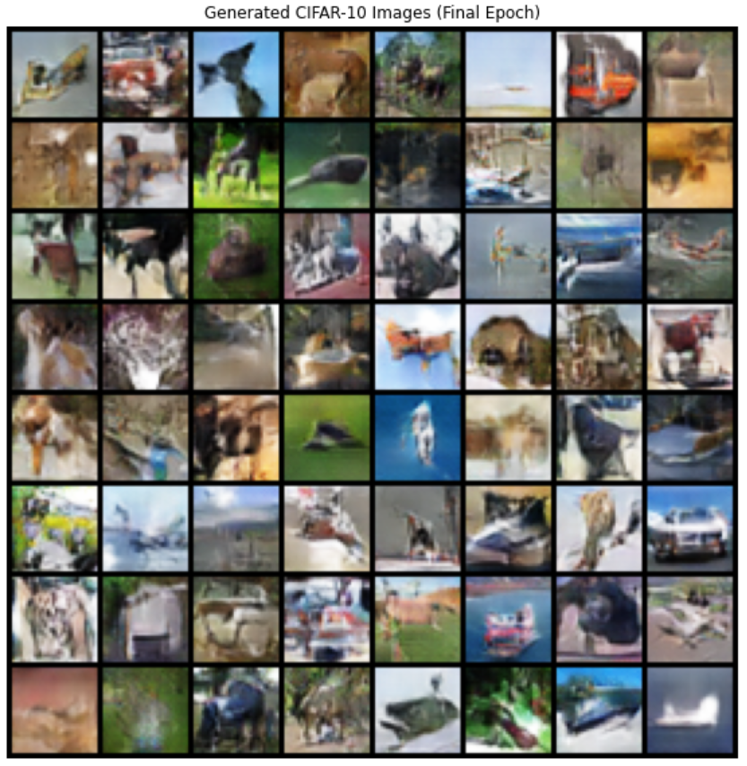

  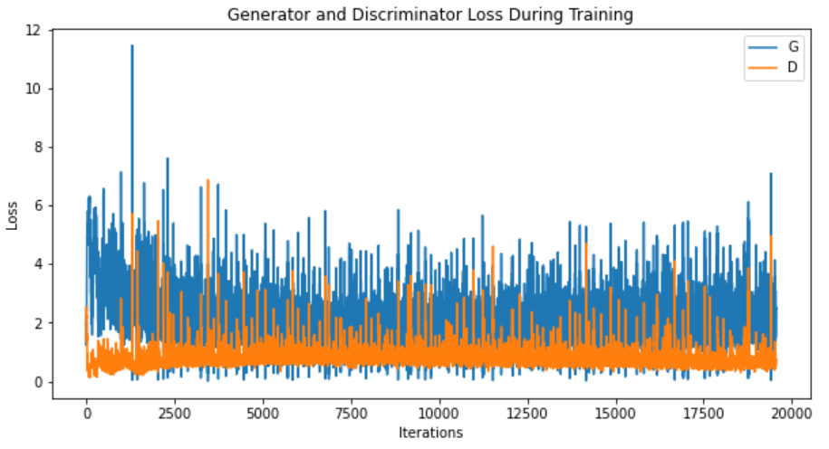

## 3. 深度生成式模型 —— 扩散模型（Diffusion）李宏毅
- **扩散模型的工作原理**

  (1)目地： 去噪：图像还原过程

  (2)扩散模型具体要去解决什么问题？

  GAN:对抗生成网络要训练生成器和判别器，不太容易收险，什么时候学习好了不确定，容易学习到噪声。关键是让生成器骗过判别器。Diffusion用一种简单的方法来诠释生成模型

  (3)什么是扩散（目地学习去噪、但前提是学习加噪）

  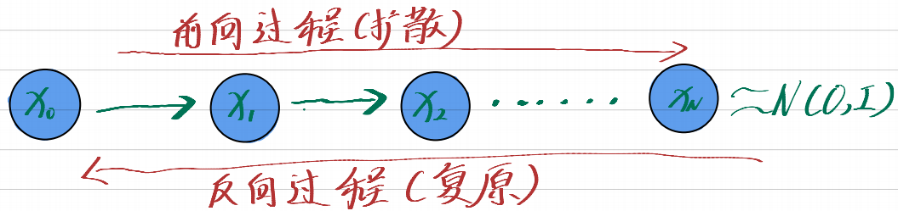

  前向过程：其实是不断往输入数据中加入噪声，最后变成了纯噪声。每个时刻都要添加高斯噪声。后一时刻都是由前一时刻增加噪声得到的其实这个过程可以看成不断构建标签（噪声）的过程。

- **核心数学概念**（噪声必须服从正态分布）

- **前向过程**（不断向数据加入噪声的过程）

  问题一 ，如何得知加时刻的分布呢？

  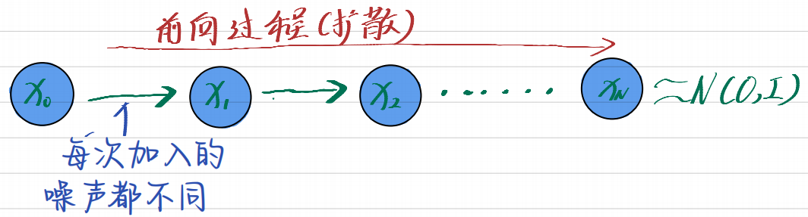

  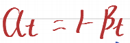，会越来越大，论文中初始从0.0001到0.002.从而也就是要越来越小，要根据加通过不断加入噪声得到

  问题二：计算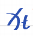就要选从开始计算，加入噪声计算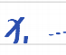这种方法叫递归像RNN 递归神经网络 会出现一个问题，串形计算，计算速度慢想要的结果直接从求中间不关心

  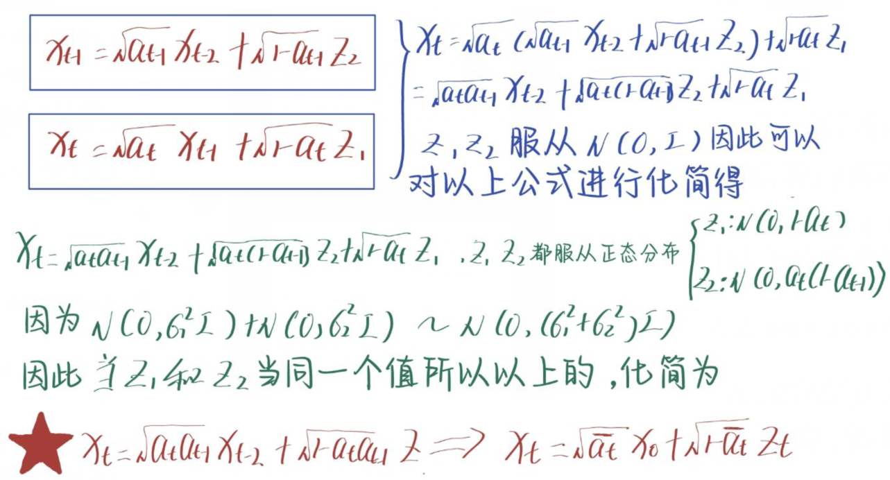

  结论：以上公式推导表明，任意时刻的分布都可以通过初始状态算出。以上的整个过程就是Diffusion的加噪过程了，但是该模型的目标是去噪生成新的数据。

- **逆向生成过程**

  模型的最终目地：知T最后时刻的数据

  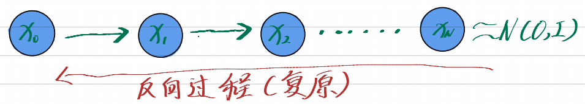

  问题一：己知求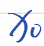首先要先求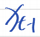但是从时刻 求时刻我们只已知T和因此求很难。

  **解决方案**：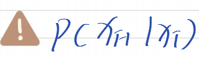很难求，因为我们不知道噪声，但是可以利用贝叶斯公式求，也就是如下面的公式推导。

  

  把正态分布展开后，乘法相当于加，除法相当于减法用此

  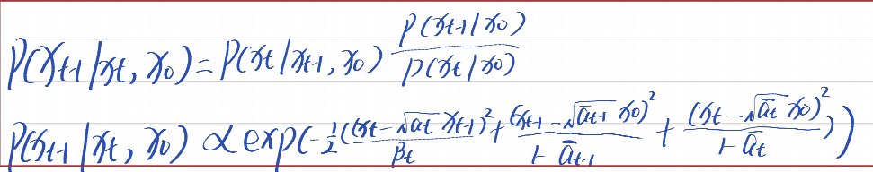

  把平方打开和并同类项：

  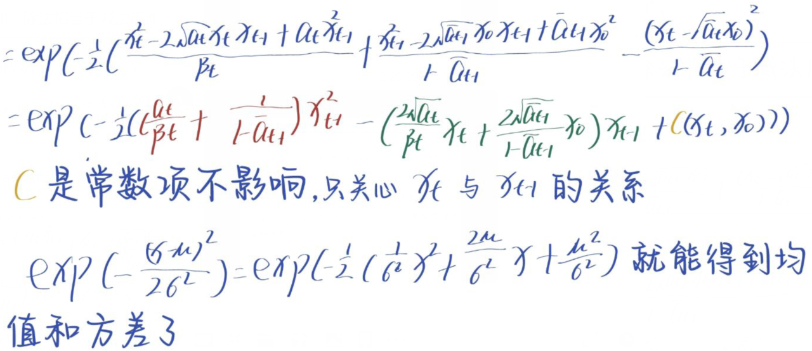

  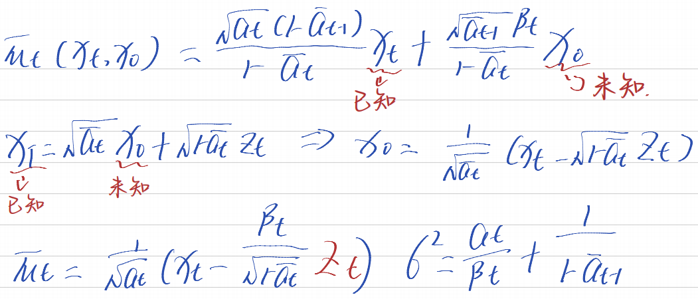

  结论：已知可以求的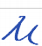和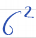

  问题二、己知并且知道这是T时刻但是求前一时刻的分布时，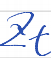是是前个时刻的噪声，也就是我们必须求时刻到时刻时刻加入的噪声但是这个时刻我们应刻怎么做？

  解决方法：用一个模型来预测介时刻的操声。该模型的loss而计算出来的Z与前向传播的Z作为损失也就是前向过程提供标签反向过程使用这个标签。

  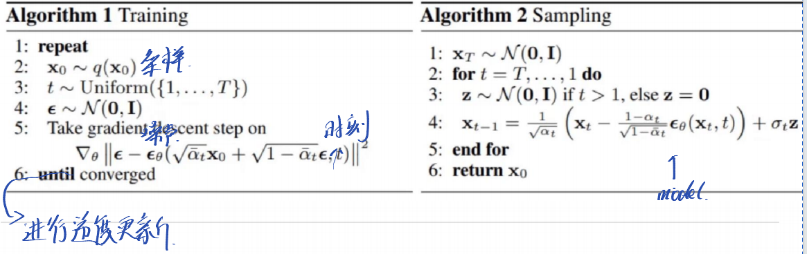

- **扩散模型的实际运用**

  ```
  import numpy as np
  import matplotlib.pyplot as plt
  import torch
  import torch.nn as nn
  from sklearn.datasets import make_swiss_roll
  # 设置随机种子，确保每次运行结果一致
  torch.manual_seed(42)
  np.random.seed(42)
  # 设置随机种子，确保每次运行结果一致
  torch.manual_seed(42)
  np.random.seed(42)
  # 生成训练数据
  train_data = create_swiss_roll_data(1500)
  print(f"训练数据形状: {train_data.shape}")
  ```

  训练结果：训练数据形状: (1500, 2)

  ```
  # 可视化原始数据
  
  # 永久保存配置（只需运行一次）
  plt.rcParams['font.sans-serif'] = ['Microsoft YaHei', 'SimHei', 'PingFang HK']
  plt.rcParams['axes.unicode_minus'] = False
  
  plt.figure(figsize=(6, 5))
  plt.scatter(train_data[:, 0], train_data[:, 1], alpha=0.6, s=10, c=range(len(train_data)), cmap='viridis')
  plt.title("瑞士卷训练数据分布")
  plt.xlabel("X坐标")
  plt.ylabel("Y坐标")
  plt.grid(True, alpha=0.3)
  plt.colorbar(label='数据点索引')
  plt.show()
  ```

  训练结果：

  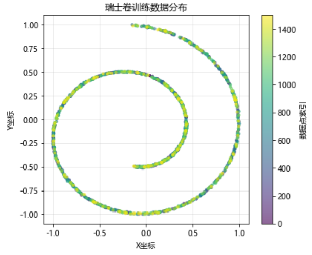

  ```
  #第二步：定义扩散过程参数 
  class SimpleDiffusion:
      """简化的扩散过程管理器"""
      
      def __init__(self, num_steps=100):
          self.num_steps = num_steps  # 扩散的总步数
          
          # 创建β值：从0.0001线性增加到0.02
          # β值控制每一步添加的噪声量
          self.betas = torch.linspace(0.0001, 0.02, num_steps)
          
          # 计算α值：α = 1 - β
          self.alphas = 1.0 - self.betas
          
          # 计算α的累积乘积：ᾱ_t = α_1 * α_2 * ... * α_t
          # 这个值会随着t增大而减小，表示原始信号保留的比例
          self.alpha_bars = torch.cumprod(self.alphas, dim=0)
      
      def add_noise(self, original_data, timestep, noise):
          """
          向原始数据添加噪声
          公式: x_t = √ᾱ_t * x_0 + √(1-ᾱ_t) * ε
          """
          #sqrt_alpha_bar = torch.sqrt(self.alpha_bars[timestep])
          # self.alpha_bars 是 (num_steps,)，通过 timestep 索引得到 (batch_size,)
          alpha_bar_t = self.alpha_bars[timestep]  # shape: (batch_size,)
          
          # 扩展为 (batch_size, 1) 以便与 (batch_size, 2) 广播
          sqrt_alpha_bar = torch.sqrt(alpha_bar_t).unsqueeze(-1) 
          
         #sqrt_one_minus_alpha_bar = torch.sqrt(1.0 - self.alpha_bars[timestep])
          sqrt_one_minus_alpha_bar = torch.sqrt(1.0 - alpha_bar_t).unsqueeze(-1)  # (B, 1)
          noisy_data = sqrt_alpha_bar * original_data + sqrt_one_minus_alpha_bar * noise
          return noisy_data
  # 创建扩散过程管理器
  diffusion = SimpleDiffusion(num_steps=100)
  print("扩散参数设置完成！")
  print(f"β值范围: {diffusion.betas[0]:.4f} 到 {diffusion.betas[-1]:.4f}")
  print(f"ᾱ值范围: {diffusion.alpha_bars[0]:.4f} 到 {diffusion.alpha_bars[-1]:.4f}")        
  
  ```

  训练结果：

  ```
  扩散参数设置完成！
  β值范围: 0.0001 到 0.0200
  ᾱ值范围: 0.9999 到 0.3636
  ```

  ```
  #第三步：可视化前向扩散过程 
  def visualize_forward_process(data, diffusion, num_samples=5):
      """展示数据如何随着时间步逐渐变成噪声"""
      
      # 选择几个数据点进行演示
      sample_indices = np.random.choice(len(data), num_samples, replace=False)
      samples = data[sample_indices]
      
      # 选择关键的时间步进行可视化
      timesteps_to_show = [0, 10, 30, 60, 90, 99]
      
      plt.figure(figsize=(15, 8))
      
      for i, t in enumerate(timesteps_to_show):
          plt.subplot(2, 3, i+1)
          
          # 对每个样本点添加噪声
          for j, sample in enumerate(samples):
              x0 = torch.tensor(sample)
              noise = torch.randn_like(x0)
              xt = diffusion.add_noise(x0, t, noise)
              
              # 绘制轨迹线（从原始点到加噪点）
              if t > 0:
                  # 找到前一个时间步的位置
                  t_prev = max(0, t-10)
                  noise_prev = torch.randn_like(x0)
                  xt_prev = diffusion.add_noise(x0, t_prev, noise_prev)
                  
                  plt.plot([xt_prev[0], xt[0]], [xt_prev[1], xt[1]], 
                          alpha=0.3, linewidth=1, color=f'C{j}')
              
              # 绘制当前时间步的点
              plt.scatter(xt[0], xt[1], s=50, alpha=0.7, color=f'C{j}', 
                         label=f'样本{j+1}' if i==0 else "")
          
          #plt.title(f'时间步 t={t}\nᾱ_t={diffusion.alpha_bars[t]:.3f}')
          plt.title(rf'时间步 $t={t}$' '\n' rf'$\bar{{\alpha}}_{{t}}={diffusion.alpha_bars[t]:.3f}$')
          plt.xlim(-1.5, 1.5)
          plt.ylim(-1.5, 1.5)
          plt.grid(True, alpha=0.3)
          
          if i == 0:
              plt.legend()
      
      plt.suptitle('前向扩散过程：数据点逐渐变成随机噪声（显示轨迹）', fontsize=14, y=1.02)
      plt.tight_layout()
      plt.show()
  # 演示前向扩散过程
  visualize_forward_process(train_data, diffusion, num_samples=5)
  ```

  训练结果

  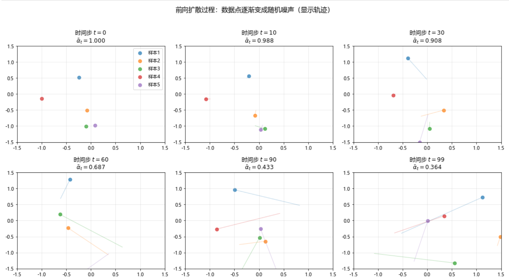

  ```
  #第四步：构建噪声预测模型 
  class SimpleNoisePredictor(nn.Module):
      """一个简单的神经网络来预测噪声"""
      
      def __init__(self, input_size=2, hidden_size=128):
          super().__init__()
          
          self.network = nn.Sequential(
              # 输入是2D坐标 + 时间步信息
              nn.Linear(input_size + 1, hidden_size),
              nn.ReLU(),
              nn.Linear(hidden_size, hidden_size),
              nn.ReLU(), 
              nn.Linear(hidden_size, hidden_size),
              nn.ReLU(),
              nn.Linear(hidden_size, input_size)  # 输出预测的噪声（也是2D）
          )
      
      def forward(self, x, t):
          """输入加噪的数据x和时间步t，预测噪声"""
          # 将时间步信息拼接到数据中
          # t 可能是标量（可视化）或 (batch_size,) 张量（训练）
          if t.dim() == 0:
              # 如果 t 是标量（如 tensor(50)），扩展成 (batch_size,)
              t = t.expand(x.shape[0])
      
          # 关键修复：将 (B,) 变成 (B, 1)
          t_normalized = (t.float() / 100.0).unsqueeze(-1)  # (B, 1)
          model_input = torch.cat([x, t_normalized], dim=1)
          
          # 预测噪声
          predicted_noise = self.network(model_input)
          return predicted_noise
    
  # 创建模型
  model = SimpleNoisePredictor()
  print("模型结构:")
  print(model)
  ```

  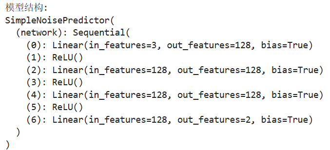

  ```
   #第五步：训练扩散模型 
  def train_diffusion_model(model, data, diffusion, epochs=1000, batch_size=128, lr=0.001):
      """训练扩散模型"""
      optimizer = torch.optim.Adam(model.parameters(), lr=lr)
      losses = []
      
      # 将数据转换为PyTorch张量
      data_tensor = torch.tensor(data)
      
      for epoch in range(epochs):
          # 随机选择一批数据
          indices = torch.randint(0, len(data_tensor), (batch_size,))
          batch = data_tensor[indices]
          
          # 随机选择时间步
          timesteps = torch.randint(0, diffusion.num_steps, (batch_size,))
          
          # 生成随机噪声（这是我们希望模型学习预测的）
          noise = torch.randn_like(batch)
          
          # 前向扩散：向数据添加噪声
          noisy_data = diffusion.add_noise(batch, timesteps, noise)
          
          # 用模型预测噪声
          predicted_noise = model(noisy_data, timesteps.float())
          
          # 计算损失：预测噪声与真实噪声的差异
          loss = torch.mean((predicted_noise - noise) ** 2)
          
          # 反向传播
          optimizer.zero_grad()
          loss.backward()
          optimizer.step()
          
          losses.append(loss.item())
          
          # 每100轮打印一次进度
          if epoch % 100 == 0:
              print(f'轮次 {epoch}, 损失: {loss.item():.6f}')
      
      return losses
      
  # 开始训练！
  losses = train_diffusion_model(model, train_data, diffusion, epochs=1000, lr=0.001)
  # 绘制损失曲线
  plt.figure(figsize=(10, 4))
  plt.plot(losses)
  plt.title('训练损失曲线')
  plt.xlabel('训练轮次')
  plt.ylabel('MSE损失')
  plt.grid(True, alpha=0.3)
  plt.show()
  ```

  训练结果：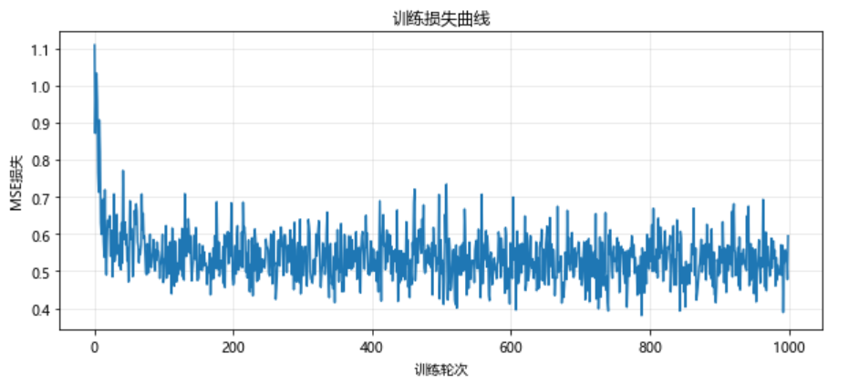

  ```
  #第六步：生成新样本（反向去噪）
  @torch.no_grad()
  def generate_samples(model, diffusion, num_samples=200):
      """从纯噪声开始，逐步去噪生成新样本"""
      
      # 1. 从标准正态分布采样随机噪声
      x = torch.randn(num_samples, 2)
      
      # 存储生成过程用于可视化轨迹
      generation_steps = []
      timesteps_record = []
      
      print("开始反向扩散过程...")
      
      # 2. 从最后一步开始逐步去噪
      for t in reversed(range(diffusion.num_steps)):
          # 创建时间步张量
          t_tensor = torch.tensor(t, dtype=torch.float32).repeat(x.shape[0])
          
          # 用模型预测噪声
          predicted_noise = model(x, t_tensor)
          
          # 获取当前时间步的参数
          alpha_t = diffusion.alphas[t]
          alpha_bar_t = diffusion.alpha_bars[t]
          beta_t = diffusion.betas[t]
          
          # 去噪步骤
          if t > 0:
              # 计算均值
              mean = (x - beta_t * predicted_noise / torch.sqrt(1 - alpha_bar_t)) / torch.sqrt(alpha_t)
              
              # 计算方差
              variance = diffusion.betas[t]
              
              # 添加随机噪声
              noise = torch.randn_like(x)
              x = mean + torch.sqrt(variance) * noise
          else:
              # 最后一步：不添加噪声
              x = (x - beta_t * predicted_noise / torch.sqrt(1 - alpha_bar_t)) / torch.sqrt(alpha_t)
          
          # 每10步保存一次中间结果用于可视化轨迹
          if t % 10 == 0 or t == 0:
              generation_steps.append(x.numpy().copy())
              timesteps_record.append(t)
              print(f"时间步 {t}: 去噪中...")
      
      return x.numpy(), generation_steps, timesteps_record
    
  # 生成新样本！
  generated_samples, generation_process, timesteps = generate_samples(model, diffusion, num_samples=300)
  ```

  训练结果：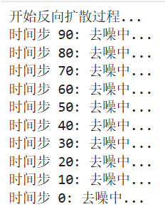

  ```
  #第七步：可视化生成结果和轨迹 
  # 绘制最终结果对比
  plt.figure(figsize=(15, 5))
  
  # 子图1：原始训练数据
  plt.subplot(1, 3, 1)
  plt.scatter(train_data[:, 0], train_data[:, 1], alpha=0.6, s=10, c='blue')
  plt.title('原始瑞士卷数据')
  plt.xlim(-1.5, 1.5)
  plt.ylim(-1.5, 1.5)
  plt.grid(True, alpha=0.3)
  
  # 子图2：模型生成的数据
  plt.subplot(1, 3, 2)
  plt.scatter(generated_samples[:, 0], generated_samples[:, 1], alpha=0.6, s=10, color='red')
  plt.title('模型生成的瑞士卷数据')
  plt.xlim(-1.5, 1.5)
  plt.ylim(-1.5, 1.5)
  plt.grid(True, alpha=0.3)
  
  # 子图3：两者对比
  plt.subplot(1, 3, 3)
  plt.scatter(train_data[:, 0], train_data[:, 1], alpha=0.3, s=10, label='真实数据', color='blue')
  plt.scatter(generated_samples[:, 0], generated_samples[:, 1], alpha=0.6, s=10, color='red', label='生成数据')
  plt.title('真实数据 vs 生成数据')
  plt.xlim(-1.5, 1.5)
  plt.ylim(-1.5, 1.5)
  plt.legend()
  plt.grid(True, alpha=0.3)
  
  plt.tight_layout()
  plt.show()
  ```

  训练结果：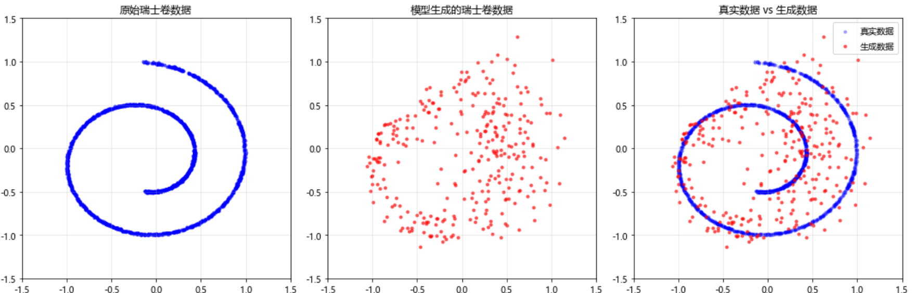

  ```
  # 可视化反向去噪过程轨迹
  print("\n可视化反向去噪轨迹：从噪声逐步形成瑞士卷...")
  plt.figure(figsize=(15, 10))
  
  # 选择几个关键步骤进行展示
  steps_to_show = 6
  selected_steps = np.linspace(0, len(generation_process)-1, steps_to_show, dtype=int)
  
  for i, step_idx in enumerate(selected_steps):
      plt.subplot(2, 3, i+1)
      step_data = generation_process[step_idx]
      t = timesteps[step_idx]
      
      # 绘制数据点
      plt.scatter(step_data[:, 0], step_data[:, 1], alpha=0.6, s=10, 
                 c=range(len(step_data)), cmap='viridis')
      
      # 如果是第一步（纯噪声）或最后一步（生成结果），用特殊颜色
      if t == 99:
          plt.title(f'初始状态: t={t}\n(纯噪声)')
          color = 'red'
      elif t == 0:
          plt.title(f'最终结果: t={t}\n(完全去噪)')
          color = 'green'
      else:
          plt.title(f'去噪步骤: t={t}')
          color = 'blue'
      
      plt.xlim(-2, 2)
      plt.ylim(-2, 2)
      plt.grid(True, alpha=0.3)
      plt.colorbar(label='样本索引')
  
  plt.suptitle('反向去噪过程：从随机噪声逐步形成瑞士卷分布', fontsize=14, y=1.02)
  plt.tight_layout()
  plt.show()
  ```

  训练结果：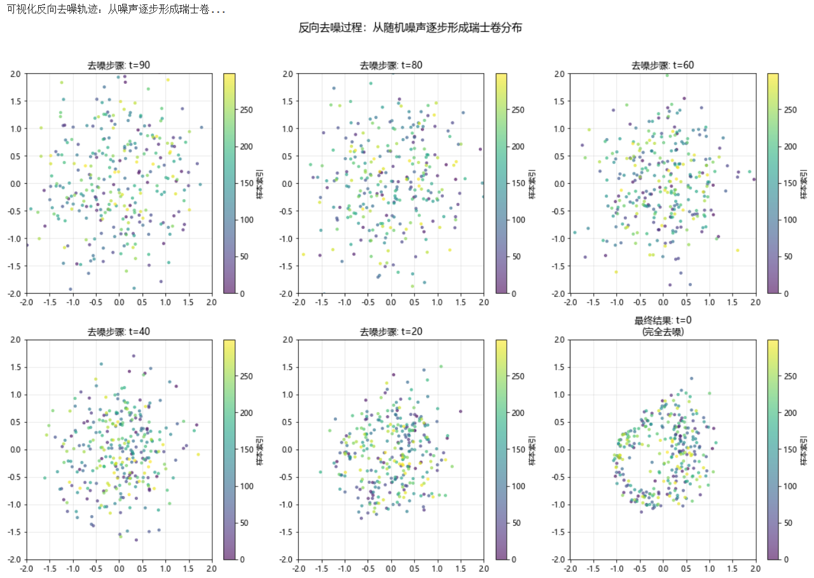

  ```
  # 可视化单个样本的生成轨迹
  print("\n可视化单个样本的生成轨迹...")
  plt.figure(figsize=(12, 10))
  
  # 跟踪几个样本的生成轨迹
  num_track_samples = 3
  sample_indices = np.random.choice(len(generation_process[0]), num_track_samples, replace=False)
  
  for i, sample_idx in enumerate(sample_indices):
      # 提取这个样本在所有时间步的位置
      trajectory_x = [step[sample_idx, 0] for step in generation_process]
      trajectory_y = [step[sample_idx, 1] for step in generation_process]
      
      plt.subplot(2, 2, i+1)
      
      # 绘制轨迹线
      plt.plot(trajectory_x, trajectory_y, 'o-', alpha=0.6, linewidth=2, 
               label=f'样本{sample_idx+1}轨迹', color=f'C{i}')
      
      # 标记起点和终点
      plt.scatter(trajectory_x[0], trajectory_y[0], s=100, color='red', 
                  marker='*', label='起点 (噪声)', zorder=5)
      plt.scatter(trajectory_x[-1], trajectory_y[-1], s=100, color='green', 
                  marker='s', label='终点 (生成点)', zorder=5)
      
      plt.title(f'样本 {sample_idx+1} 的生成轨迹')
      plt.xlim(-2, 2)
      plt.ylim(-2, 2)
      plt.grid(True, alpha=0.3)
      plt.legend()
  
  # 最后一个子图显示所有轨迹
  plt.subplot(2, 2, 4)
  for i, sample_idx in enumerate(sample_indices):
      trajectory_x = [step[sample_idx, 0] for step in generation_process]
      trajectory_y = [step[sample_idx, 1] for step in generation_process]
      plt.plot(trajectory_x, trajectory_y, 'o-', alpha=0.6, linewidth=2, 
               label=f'样本{sample_idx+1}', color=f'C{i}')
  
  plt.title('所有样本轨迹对比')
  plt.xlim(-2, 2)
  plt.ylim(-2, 2)
  plt.grid(True, alpha=0.3)
  plt.legend()
  
  plt.suptitle('单个样本在反向去噪过程中的运动轨迹', fontsize=14, y=1.02)
  plt.tight_layout()
  plt.show()
  
  print("\n=== 训练完成！ ===")
  print(" 使用瑞士卷数据集")
  print(" 手动实现前向加噪和反向去噪") 
  print(" 完整可视化噪声变化轨迹")
  print(" 2D Diffusion模型toy示例运行成功！")
  ```

  训练结果：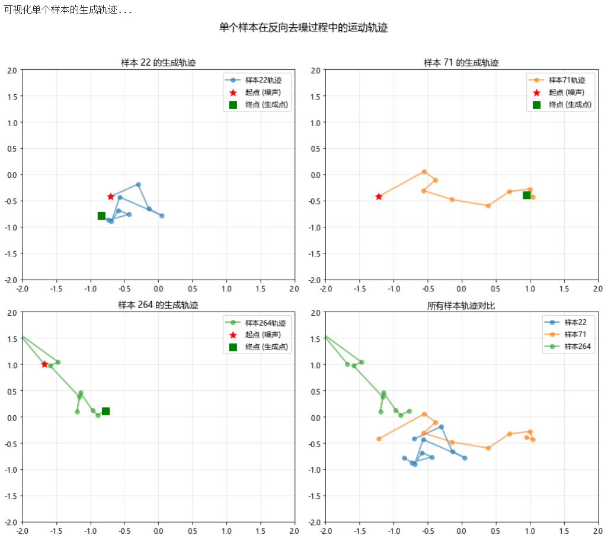

  ```
  import torch
  import torch.nn as nn
  import math
  
  class SinusoidalTimeEmbedding(nn.Module):
      """正弦时间编码，将标量 t 映射为高维向量"""
      def __init__(self, dim):
          super().__init__()
          self.dim = dim
  
      def forward(self, t):
          # t: (B,)
          device = t.device
          half_dim = self.dim // 2
          embeddings = math.log(10000) / (half_dim - 1)
          embeddings = torch.exp(torch.arange(half_dim, device=device) * -embeddings)
          embeddings = t.unsqueeze(1) * embeddings.unsqueeze(0)  # (B, half_dim)
          embeddings = torch.cat((embeddings.sin(), embeddings.cos()), dim=1)  # (B, dim)
          return embeddings
  
  class ImprovedNoisePredictor(nn.Module):
      def __init__(self, input_size=2, time_emb_dim=32, hidden_size=256):
          super().__init__()
          self.input_size = input_size
          
          # 时间嵌入模块
          self.time_mlp = nn.Sequential(
              SinusoidalTimeEmbedding(time_emb_dim),
              nn.Linear(time_emb_dim, hidden_size),
              nn.SiLU(),
              nn.Linear(hidden_size, hidden_size)
          )
          
          # 主干网络（带残差或 FiLM 调制更佳，这里先用简单拼接）
          self.proj_in = nn.Linear(input_size, hidden_size)
          self.layers = nn.ModuleList([
              nn.Sequential(
                  nn.Linear(hidden_size + hidden_size, hidden_size),  # 拼接 x 和 time_emb
                  nn.SiLU(),
                  nn.LayerNorm(hidden_size)
              ),
              nn.Sequential(
                  nn.Linear(hidden_size + hidden_size, hidden_size),
                  nn.SiLU(),
                  nn.LayerNorm(hidden_size)
              ),
              nn.Sequential(
                  nn.Linear(hidden_size + hidden_size, hidden_size),
                  nn.SiLU(),
                  nn.LayerNorm(hidden_size)
              )
          ])
          self.proj_out = nn.Linear(hidden_size, input_size)
  
      def forward(self, x, t):
          # x: (B, 2), t: (B,)
          if t.dim() == 0:
              t = t.expand(x.shape[0])
          
          # 编码时间步
          time_emb = self.time_mlp(t.float())  # (B, hidden_size)
          
          # 投影输入
          h = self.proj_in(x)  # (B, hidden_size)
          
          # 逐层融合时间信息
          for layer in self.layers:
              h_time = torch.cat([h, time_emb], dim=-1)  # (B, 2*hidden_size)
              h = layer(h_time)  # (B, hidden_size)
          
          out = self.proj_out(h)  # (B, 2)
          return out
        
  # 替换原来的模型
  model = ImprovedNoisePredictor(input_size=2, time_emb_dim=32, hidden_size=256)
  
  # 其他训练代码不变！
  losses = train_diffusion_model(model, train_data, diffusion, epochs=3000, lr=0.002)
  ```

  训练结果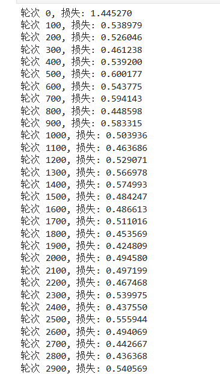

  ```
  #第六步：生成新样本（反向去噪）
  @torch.no_grad()
  def generate_samples(model, diffusion, num_samples=200):
      """从纯噪声开始，逐步去噪生成新样本"""
      
      # 1. 从标准正态分布采样随机噪声
      x = torch.randn(num_samples, 2)
      
      # 存储生成过程用于可视化轨迹
      generation_steps = []
      timesteps_record = []
      
      print("开始反向扩散过程...")
      
      # 2. 从最后一步开始逐步去噪
      for t in reversed(range(diffusion.num_steps)):
          # 创建时间步张量
          t_tensor = torch.tensor(t, dtype=torch.float32).repeat(x.shape[0])
          
          # 用模型预测噪声
          predicted_noise = model(x, t_tensor)
          
          # 获取当前时间步的参数
          alpha_t = diffusion.alphas[t]
          alpha_bar_t = diffusion.alpha_bars[t]
          beta_t = diffusion.betas[t]
          
          # 去噪步骤
          if t > 0:
              # 计算均值
              mean = (x - beta_t * predicted_noise / torch.sqrt(1 - alpha_bar_t)) / torch.sqrt(alpha_t)
              
              # 计算方差
              variance = diffusion.betas[t]
              
              # 添加随机噪声
              noise = torch.randn_like(x)
              x = mean + torch.sqrt(variance) * noise
          else:
              # 最后一步：不添加噪声
              x = (x - beta_t * predicted_noise / torch.sqrt(1 - alpha_bar_t)) / torch.sqrt(alpha_t)
          
          # 每10步保存一次中间结果用于可视化轨迹
          if t % 10 == 0 or t == 0:
              generation_steps.append(x.numpy().copy())
              timesteps_record.append(t)
              print(f"时间步 {t}: 去噪中...")
      
      return x.numpy(), generation_steps, timesteps_record
  # 生成新样本！
  generated_samples, generation_process, timesteps = generate_samples(model, diffusion, num_samples=400)
  ```

  训练结果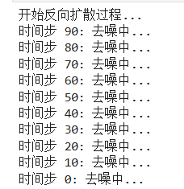

  ```
  #第七步：可视化生成结果和轨迹 
  # 绘制最终结果对比
  plt.figure(figsize=(15, 5))
  
  # 子图1：原始训练数据
  plt.subplot(1, 3, 1)
  plt.scatter(train_data[:, 0], train_data[:, 1], alpha=0.6, s=10, c='blue')
  plt.title('原始瑞士卷数据')
  plt.xlim(-1.5, 1.5)
  plt.ylim(-1.5, 1.5)
  plt.grid(True, alpha=0.3)
  
  # 子图2：模型生成的数据
  plt.subplot(1, 3, 2)
  plt.scatter(generated_samples[:, 0], generated_samples[:, 1], alpha=0.6, s=10, color='red')
  plt.title('模型生成的瑞士卷数据')
  plt.xlim(-1.5, 1.5)
  plt.ylim(-1.5, 1.5)
  plt.grid(True, alpha=0.3)
  
  # 子图3：两者对比
  plt.subplot(1, 3, 3)
  plt.scatter(train_data[:, 0], train_data[:, 1], alpha=0.3, s=10, label='真实数据', color='blue')
  plt.scatter(generated_samples[:, 0], generated_samples[:, 1], alpha=0.6, s=10, color='red', label='生成数据')
  plt.title('真实数据 vs 生成数据')
  plt.xlim(-1.5, 1.5)
  plt.ylim(-1.5, 1.5)
  plt.legend()
  plt.grid(True, alpha=0.3)
  
  plt.tight_layout()
  plt.show()
  ```

  训练结果：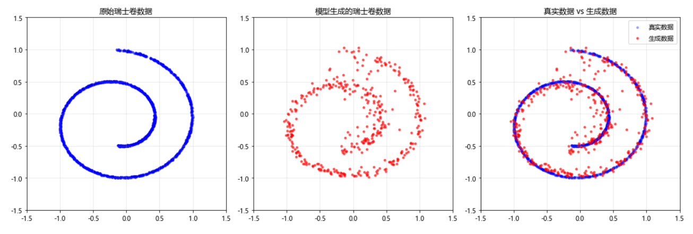

Diffusion（Ho et al., 2020）

## 4.自回归/Transformer(GPT)

- **什么是自回归模型**：

  （1）自回归是时间序列模型，训练得到的模型表示了随时间变化的 y 之间的相互依赖性与相关性。同时自回归是统计上一种处理时间序列的方法，用同一变数例如x的之前各期，亦即x1至xt-1来预测本期xt的表现，并假设它们为一线性关系。因为这是从回归分析中的线性回归发展而来，只是不用x预测y，而是用x预测 x（自己）；所以叫做自回归。

  （2）简单来说也就是拿过去的数据预测未来的数据。比如预测明天的降雨量，就看过去7天的降雨数据；预测下个月的销售额，参考前3个月的业绩。

  （3）自回归Transformer是一种基于Transformer架构的语言模型，广泛应用于自然语言处理任务中，如机器翻译、文本生成和摘要生成。其核心思想是通过自回归方式逐步生成序列，即利用已生成的词作为上下文，预测下一个词。

  

- **优缺点**：自回归方法的优点是它们结构简单，易于理解和实现，可用自身变数数列来进行预测。

  自回归模型假设时间序列是平稳的，即时间序列的统计特性（如均值和方差）不随时间变化。此外，自回归模型可能不适用于那些受外部因素影响较大的时间序列数据。但是这种方法受到一定的限制：必须具有自相关，[自相关系数](https://baike.baidu.com/item/自相关系数/13332808?fromModule=lemma_inlink)(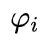)是关键。如果自相关系数(R)小于0.5，则不宜采用，否则预测结果极不准确。

  

- **损失函数**：让预测误差最小，目标最小化误差平方和。

  

- **实际运用**：自回归Transformer已经在许多领域取得了显著的成果。例如，在机器翻译领域，它能够实现高质量的翻译效果，并且相对于传统的翻译方法具有更高的效率和准确性。在文本摘要领域，自回归Transformer能够根据输入的文本自动生成简洁、准确的摘要。此外，它还可以应用于问答系统、对话系统等领域，实现更加智能化和高效的人机交互

  

- **具体的代码实现**：

  这段 Python 代码实现了一个基于自回归（AR）模型的时间序列预测系统，专门用于分析和预测著名的 “航空公司乘客数量”数据集（Airline Passengers Dataset）。这段代码实现了一个从数据获取、建模、预测到可视化诊断的完整时间序列分析流程，专门针对经典的“航空公司乘客数量”数据集进行自回归（AR）建模。它不依赖任何高级机器学习库，而是纯用 NumPy 手动构建 AR(p) 模型——通过构造滞后特征矩阵并利用最小二乘法求解参数，清晰展示了时间序列模型背后的数学原理。程序选择 p=12 阶滞后，巧妙呼应了该数据明显的年度季节性规律，并对整个历史序列进行拟合预测

  ```
  import numpy as np
  import pandas as pd
  import matplotlib.pyplot as plt
  from matplotlib.backends.backend_agg import FigureCanvasAgg as FigureCanvas
  from io import BytesIO
  from statsmodels.graphics.tsaplots import plot_acf
  import requests  # 用于下载在线数据集
  
  #  修复：移除 Helvetica，使用 Matplotlib 内置安全字体，避免警告
  plt.rcParams["font.family"] = "sans-serif"
  plt.rcParams["font.sans-serif"] = ["DejaVu Sans", "Arial", "Liberation Sans"]
  plt.rcParams['axes.unicode_minus'] = False  # 解决负号显示问题
  
  # 1. 下载并加载数据（无需本地文件，服务器直接跑）
  def load_data():
      # 在线数据集地址
      url = "https://raw.githubusercontent.com/jbrownlee/Datasets/master/airline-passengers.csv"
      response = requests.get(url)
      data = pd.read_csv(BytesIO(response.content), parse_dates=['Month'], index_col='Month')
      return data
  
  # 2. 手动实现AR模型
  def ar_model(y, p):
      """
      构建p阶自回归模型
      y: 时间序列数据（一维数组）
      p: 滞后阶数（用过去p个值预测）
      返回：最优参数 [c, phi1, phi2, ..., phip]
      """
      n = len(y)
      # 构建特征矩阵X和目标向量Y
      X = np.ones((n - p, p + 1))  # 第一列是常数项1
      Y = y[p:]  # 从第p+1个值开始作为目标
      
      # 填充X的滞后项（过去p个值）
      for i in range(n - p):
          X[i, 1:] = y[i:i+p][::-1]  # 反转顺序，让y[t-1]对应phi1
      
      # 用最小二乘法求解参数：theta = (X^T X)^(-1) X^T Y
      theta = np.linalg.inv(X.T @ X) @ X.T @ Y
      return theta
  
  # 3. 预测函数
  def predict(theta, y, p):
      """用训练好的参数预测"""
      n = len(y)
      y_pred = np.zeros(n - p)
      for i in range(n - p):
          # 预测值 = c + phi1*y[t-1] + ... + phip*y[t-p]
          y_pred[i] = theta[0] + np.dot(theta[1:], y[i:i+p][::-1])
      return y_pred
  
  # 4. 多图可视化并保存（服务器直接存图片）
  def plot_results(df, y, y_pred, p, save_path='ar_results.png'):
      # 计算残差
      residuals = y[p:] - y_pred
      
      # 创建2x2子图
      fig, axes = plt.subplots(2, 2, figsize=(16, 12))
      
      # 图1：原始数据 vs 预测值
      axes[0, 0].plot(df.index, y, label='Original Data', color='blue')
      axes[0, 0].plot(df.index[p:], y_pred, label=f'AR({p}) Predictions', color='red', linestyle='--')
      axes[0, 0].set_title('Original vs Predicted Passengers')
      axes[0, 0].set_xlabel('Year')
      axes[0, 0].set_ylabel('Number of Passengers')
      axes[0, 0].legend()
      
      # 图2：残差（预测误差）
      axes[0, 1].plot(df.index[p:], residuals, color='purple')
      axes[0, 1].axhline(y=0, color='black', linestyle='-', alpha=0.3)
      axes[0, 1].set_title('Prediction Residuals')
      axes[0, 1].set_xlabel('Year')
      axes[0, 1].set_ylabel('Error')
      
      # 图3：残差分布直方图
      axes[1, 0].hist(residuals, bins=20, color='green', alpha=0.7)
      axes[1, 0].set_title('Distribution of Residuals')
      axes[1, 0].set_xlabel('Residual Value')
      axes[1, 0].set_ylabel('Frequency')
      
      # 图4：残差自相关图（判断是否有未捕捉的规律）
      plot_acf(residuals, lags=20, ax=axes[1, 1], color='orange')
      axes[1, 1].set_title('Autocorrelation of Residuals')
      
      plt.tight_layout()
      # 保存图片到服务器
      plt.savefig(save_path, dpi=300, bbox_inches='tight')
      plt.close()
      print(f"Results saved to {save_path}")
  
  # 5. 主函数：串联所有步骤
  def main():
      # 加载数据
      df = load_data()
      y = df['Passengers'].values  # 提取乘客数量序列
      p = 12  # 滞后阶数：用过去12个月（1年）预测，符合季节性
      
      # 训练AR模型
      theta = ar_model(y, p)
      print(f"AR({p})模型参数：")
      print(f"常数项 c = {theta[0]:.2f}")
      for i in range(1, p+1):
          print(f"phi{i} = {theta[i]:.4f}", end=' | ' if i % 4 != 0 else '\n')
      
      # 预测
      y_pred = predict(theta, y, p)
      
      # 可视化结果
      plot_results(df, y, y_pred, p)
  
  if __name__ == '__main__':
      main()
  ```

  训练结果：下面包含四幅子图的高清图像全面评估模型效果：原始数据与预测值高度重合，说明模型能较好捕捉趋势与周期；残差在零附近随机波动且分布近似正态，表明无系统性偏差。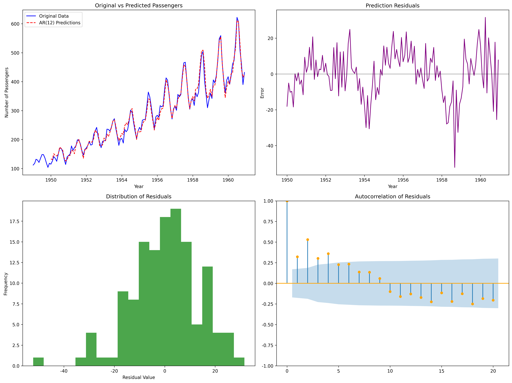

- 


## 5. 基于流的模型

- **基本概念**:流模型的建模思维基于变换函数，该函数能够将一个简单的先验分布（如高斯分布）映射到一个复杂的数据分布（如图像数据分布）。这个变换函数的存在使得从先验分布中随机采样的点能够转换成复杂分布中的样本点。在一维和二维分布的情况下，这种映射可以通过线性变换或者更复杂的变换来实现。关键在于找到一个变换函数，它不仅能够实现这种映射，而且还能够使得变换前后的概率密度保持一致。

  在流模型中，变换函数的设计需要考虑到雅各比行列式的计算，因为雅各比行列式代表了变换前后体积（或概率密度）的变化。为了简化计算，流模型采用了耦合层的设计，将输入数据分成两部分，并通过特定的函数进行变换，从而实现可逆计算和简化雅各比行列式的计算。

  

- **流模型的核心原理**：Flow模型通过一系列**可逆变换将简单分布（如正态分布）映射到目标分布**。其数学基础包括雅可比矩阵、行列式以及变量变换定理。通过这些工具，Flow模型能够直接计算目标分布的概率密度，从而优化生成器的性能。

  以下是Flow模型的主要特点：

  - **可逆性**：生成器必须是可逆的，且逆函数易于计算。

  - **雅可比矩阵行列式**：需要高效计算变换的雅可比矩阵行列式值。

  - **分层结构**：通过堆叠多个简单的变换层（如耦合层）增强生成器的能力。


- Flow模型的实现通常包括以下步骤：

  - **耦合层设计**：将输入分为两部分，一部分直接复制，另一部分通过变换函数生成输出。这种设计确保了生成器的可逆性，并简化了雅可比矩阵行列式的计算。

  - **堆叠多个耦合层**：通过交替复制不同部分的数据，避免生成结果中出现纯噪声区域。**1×1卷积**：在图像生成任务中，使用1×1卷积层打乱通道顺序，进一步提升生成器的表达能力。

    

- Flow模型在多个领域表现出色，以下是一些典型应用：

  - **图像生成**：通过Glow模型实现高质量的人脸生成与混合。

  - **语音合成**：WaveGlow模型在语音生成领域表现优异，解决了GAN在语音生成中的不稳定性问题。

  - **表情变化**：通过调整潜在空间的方向，实现人脸表情的变化。

  

- 优势与局限性

  Flow模型的**主要优势**在于其直接优化目标分布的概率密度，避免了GAN的训练不稳定性和VAE的下界优化问题。

  然而，其局限性包括：计算复杂度：高维数据的雅可比矩阵行列式计算可能较为耗时。

  模型设计限制：生成器必须满足可逆性和高效性要求。

  

- 总的来说：Flow模型为生成建模提供了一种直接且高效的解决方案，特别是在需要高质量生成结果的场景中具有显著优势。

- 代码实现：

  ```
  import numpy as np
  import torch.nn as nn
  import torch
  from tqdm import tqdm
  from scipy.integrate import solve_ivp
  
  import matplotlib.pyplot as plt
  device = torch.device("cuda" if torch.cuda.is_available() else "cpu")
  
  def make_gaussian(batch_size):
      # Sample from a 2D standard Gaussian (mean=0, std=1)
      return torch.randn(batch_size, 2)
  
  def make_checkerboard(batch_size):
      # Sample the x-coordinate uniformly in the range [-2, 2)
      x1 = torch.rand(batch_size) * 4 - 2
  
      # Sample the y-coordinate:
      # Step 1: draw from uniform [0, 1)
      # Step 2: subtract either 0 or 2, randomly (via torch.randint)
      # Result: values centered roughly around -2 or -1
      x2_ = torch.rand(batch_size) - torch.randint(high=2, size=(batch_size, )) * 2
  
      # Add a vertical shift depending on whether the x1 bin is even or odd
      # This creates the alternating row offset of the checkerboard
      x2 = x2_ + (torch.floor(x1) % 2)
  
      # Stack x1 and x2 into (batch_size, 2) vectors, and scale the whole grid
      data = 1.0 * torch.cat([x1[:, None], x2[:, None]], dim=1) / 0.45
  
      return data.float()
  # Sample points
  gaussian_samples = make_gaussian(1000)
  checkerboard_samples = make_checkerboard(1000)
  
  # Plot both
  plt.figure(figsize=(12, 6))
  
  # Plot Gaussian source
  plt.subplot(1, 2, 1)
  plt.scatter(gaussian_samples[:, 0], gaussian_samples[:, 1], alpha=0.5)
  plt.title("Gaussian Source Samples")
  plt.axis("equal")
  plt.grid(True)
  
  # Plot Checkerboard target
  plt.subplot(1, 2, 2)
  plt.scatter(checkerboard_samples[:, 0], checkerboard_samples[:, 1], alpha=0.5)
  plt.title("Checkerboard Target Samples")
  plt.axis("equal")
  plt.grid(True)
  
  plt.tight_layout()
  plt.show()
  ```

  运行结果：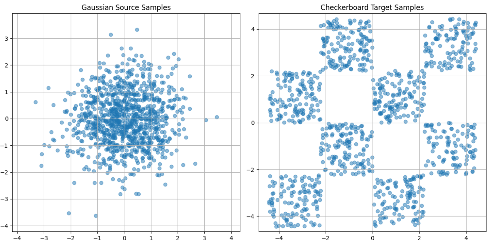

  ```
  class FlowModel(nn.Module):  # Neural network to learn the time-dependent velocity field f(x, t)
    def __init__(self, input_dim=2, time_embed_dim=64):
      super().__init__()
  
      # Small MLP to embed the time scalar t into a higher-dimensional space
      self.time_embed = nn.Sequential(
          nn.Linear(1, time_embed_dim),
          nn.SiLU(),                     # Activation function: Sigmoid Linear Unit
          nn.Linear(time_embed_dim, time_embed_dim)
      )
  
      # Main network to predict velocity, given (x, embedded t)
      self.net = nn.Sequential(
          nn.Linear(input_dim + time_embed_dim, 128),  # Input: concatenated x and t embedding
          nn.SiLU(),
          nn.Linear(128, 128),
          nn.SiLU(),
          nn.Linear(128, 128),
          nn.SiLU(),
          nn.Linear(128, 128),
          nn.SiLU(),
          nn.Linear(128, 128),
          nn.SiLU(),
          nn.Linear(128, 128),
          nn.SiLU(),
          nn.Linear(128, input_dim)  # Output: predicted velocity (same dimension as x)
      )
  
    def forward(self, x, t):
      # Embed time t (shape: [batch_size, 1]) into a higher-dimensional vector
      t_embed = self.time_embed(t)
  
      # Concatenate position x and time embedding along the last dimension
      xt = torch.cat([x, t_embed], dim=-1)
  
      # Pass through the network to predict the velocity at (x, t)
      return self.net(xt)
      
  class FlowModel(nn.Module):  # Neural network to learn the time-dependent velocity field f(x, t)
    def __init__(self, input_dim=2, time_embed_dim=64):
      super().__init__()
  
      # Small MLP to embed the time scalar t into a higher-dimensional space
      self.time_embed = nn.Sequential(
          nn.Linear(1, time_embed_dim),
          nn.SiLU(),                     # Activation function: Sigmoid Linear Unit
          nn.Linear(time_embed_dim, time_embed_dim)
      )
  
      # Main network to predict velocity, given (x, embedded t)
      self.net = nn.Sequential(
          nn.Linear(input_dim + time_embed_dim, 128),  # Input: concatenated x and t embedding
          nn.SiLU(),
          nn.Linear(128, 128),
          nn.SiLU(),
          nn.Linear(128, 128),
          nn.SiLU(),
          nn.Linear(128, 128),
          nn.SiLU(),
          nn.Linear(128, 128),
          nn.SiLU(),
          nn.Linear(128, 128),
          nn.SiLU(),
          nn.Linear(128, input_dim)  # Output: predicted velocity (same dimension as x)
      )
  
    def forward(self, x, t):
      # Embed time t (shape: [batch_size, 1]) into a higher-dimensional vector
      t_embed = self.time_embed(t)
  
      # Concatenate position x and time embedding along the last dimension
      xt = torch.cat([x, t_embed], dim=-1)
  
      # Pass through the network to predict the velocity at (x, t)
      return self.net(xt)
     
  def sample_source(batch_size):
      # Sample from a 2D standard Gaussian (mean=0, std=1)
      return torch.randn(batch_size, 2)
      
      
      
  num_steps = 10000
  batch_size = 512
  losses = []
  
  model = FlowModel().to(device)
  optimizer = torch.optim.Adam(model.parameters(), lr=5e-4)
  
  for step in tqdm(range(num_steps)):
    x0 = sample_source(batch_size).to(device)
    x1 = sample_target(batch_size).to(device)
    t = torch.rand(batch_size, 1).to(device)  # Random interpolation time ∈ [0, 1]
  
    loss = flow_matching_loss(model, x0, x1, t)
  
    optimizer.zero_grad()
    loss.backward()
    optimizer.step()
  
    losses.append(loss.item())
  
    if step % 100 == 0:
      print(f"Step {step} | Loss: {loss.item():.4f}")
  ```

  运行结果：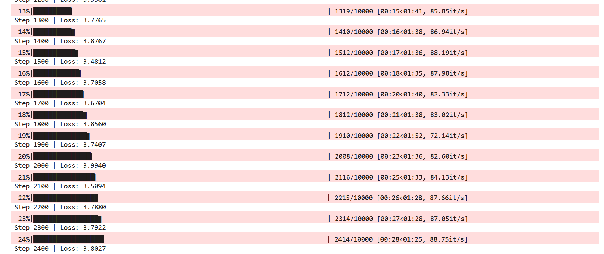

  ```
  # Plot after training
  plt.plot(losses)
  plt.xlabel("Step")
  plt.ylabel("Loss")
  plt.title("Training Loss Curve")
  plt.grid(True)
  plt.show()
  ```

  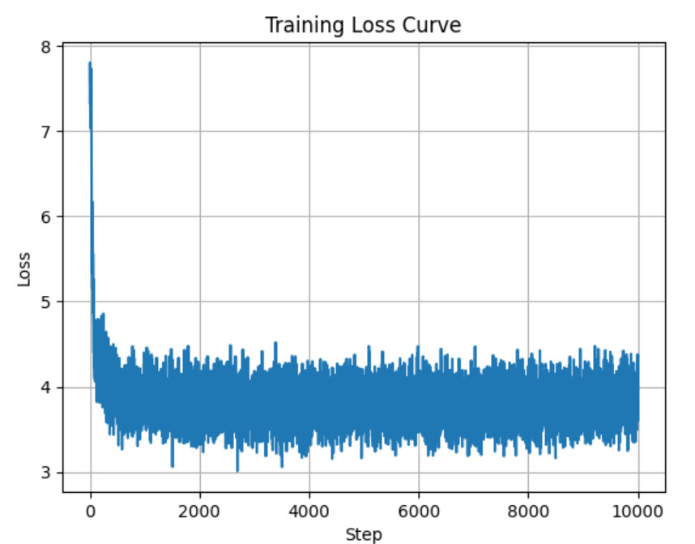

  ```
  def plot_velocity_row(model, t_values=[0.0, 0.25, 0.5, 0.75, 1.0], grid_size=20):
      model.eval()
      with torch.no_grad():
          # Set up grid and figure
          fig, axes = plt.subplots(1, len(t_values), figsize=(4 * len(t_values), 4))
          x = np.linspace(-4, 4, grid_size)
          y = np.linspace(-4, 4, grid_size)
          xx, yy = np.meshgrid(x, y)
          xy = np.stack([xx.flatten(), yy.flatten()], axis=1)
          xt = torch.tensor(xy, dtype=torch.float32).to(device)
  
          for i, t_val in enumerate(t_values):
              # Repeat t for each grid point
              tt = torch.full((xt.shape[0], 1), t_val, dtype=torch.float32).to(device)
  
              # Predict velocity vectors
              v = model(xt, tt).cpu().numpy()
  
              # Plot velocity field as arrows
              ax = axes[i]
              ax.quiver(xx, yy,
                        v[:, 0].reshape(grid_size, grid_size),
                        v[:, 1].reshape(grid_size, grid_size),
                        scale=20)
              ax.set_title(f"t = {t_val}")
              ax.axis("equal")
              ax.grid(True)
  
          plt.tight_layout()
          plt.show()
          
  plot_velocity_row(model)
  ```

  运行结果:

  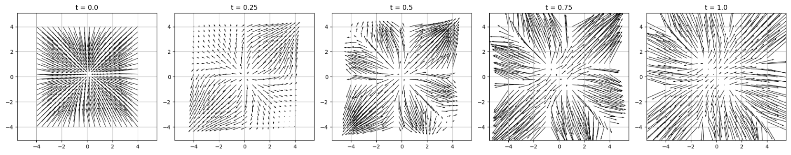

  ```
  def sample_flow(model, x0, t_span=(0, 1)):
      """
      Evolve x0 through the learned flow to produce a sample from p1.
      """
      def ode_func(t, x):
          # Convert input x and time t into proper torch tensors
          x_tensor = torch.tensor(x, dtype=torch.float32).unsqueeze(0).to(device)
          t_tensor = torch.tensor([[t]], dtype=torch.float32).to(device)
  
          # Predict velocity without tracking gradients
          with torch.no_grad():
              v = model(x_tensor, t_tensor)
  
          # Return velocity as NumPy array (shape: [2])
          return v.squeeze(0).cpu().numpy()
  
      # Solve ODE from t=0 to t=1 using the learned velocity field
      sol = solve_ivp(ode_func, t_span, x0.cpu().numpy(), t_eval=[t_span[1]])
  
      # Return the final state at t=1 (i.e. predicted x1)
      return sol.y[:, -1]
  samples = []
  
  # Sample 1000 points from the source distribution p₀
  x0 = sample_source(1000).to(device)
  
  # Push each point through the learned flow to generate a sample from p₁
  for x in x0:
      with torch.no_grad():
          x = x.to(device)
          x1_hat = sample_flow(model, x, t_span=(0, 1))  # Integrate flow from t=0 to t=1
          samples.append(x1_hat)
  
  # Convert list of sampled points to NumPy array for plotting
  samples = np.array(samples)
  
  # Scatter plot of generated samples in 2D
  plt.scatter(samples[:, 0], samples[:, 1], alpha=0.6)
  plt.title("Generated Samples from Flow Matching")
  plt.axis("equal")
  plt.grid(True)
  plt.show()
  ```

  运行结果：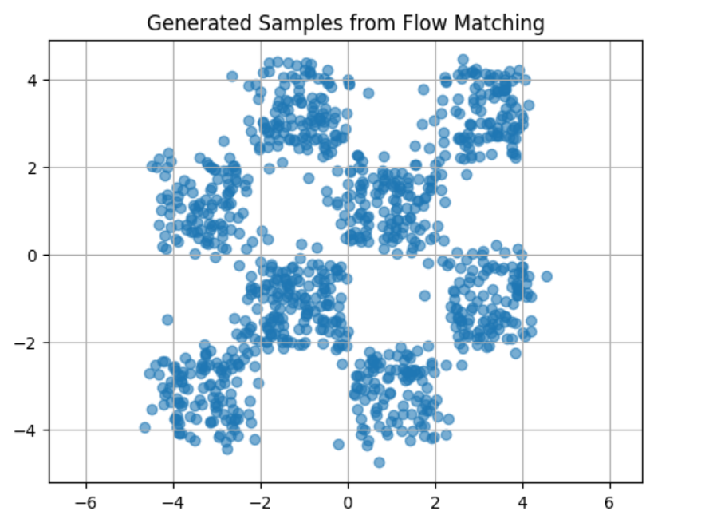

```
real = sample_target(1000)
gen = np.array(samples)

plt.figure(figsize=(10, 5))

plt.subplot(1, 2, 1)
plt.scatter(real[:, 0], real[:, 1], alpha=0.3)
plt.title("Target: Checkerboard")

plt.subplot(1, 2, 2)
plt.scatter(gen[:, 0], gen[:, 1], alpha=0.3)
plt.title("Generated from Model")

plt.show()

```

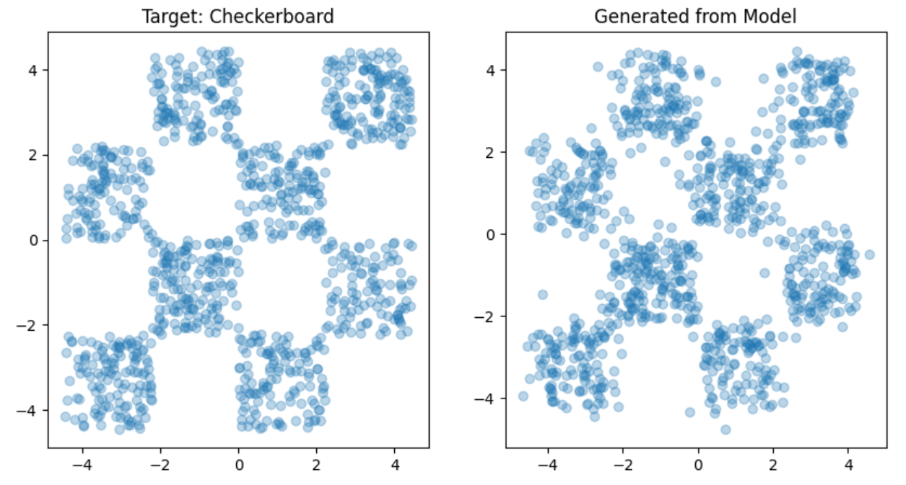


